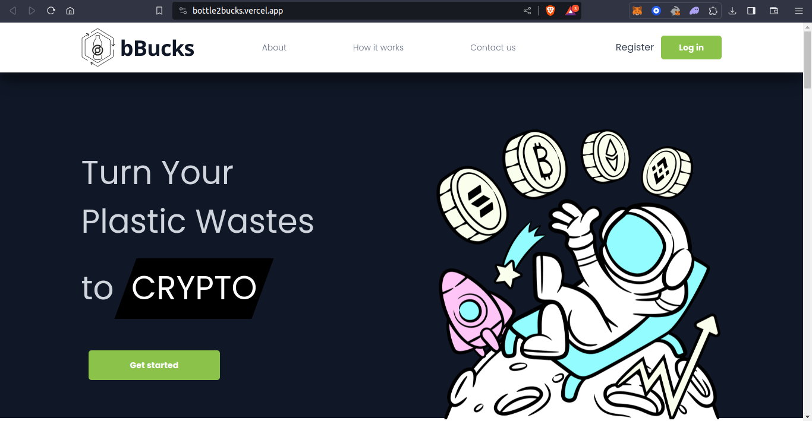
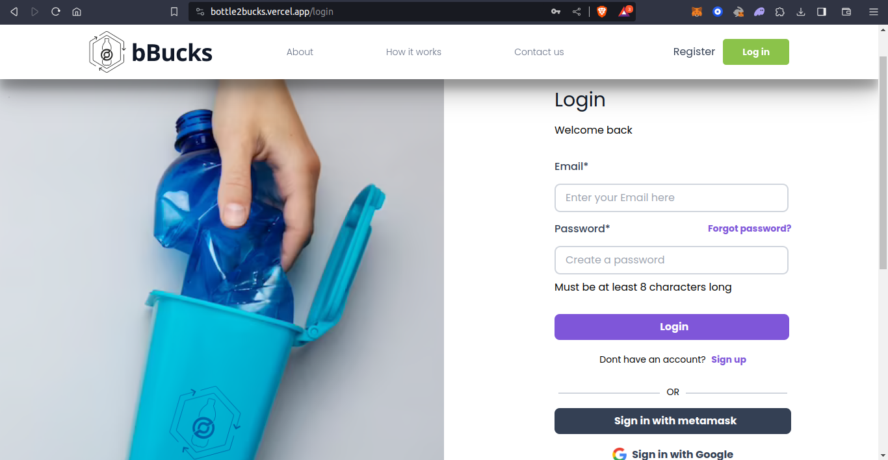
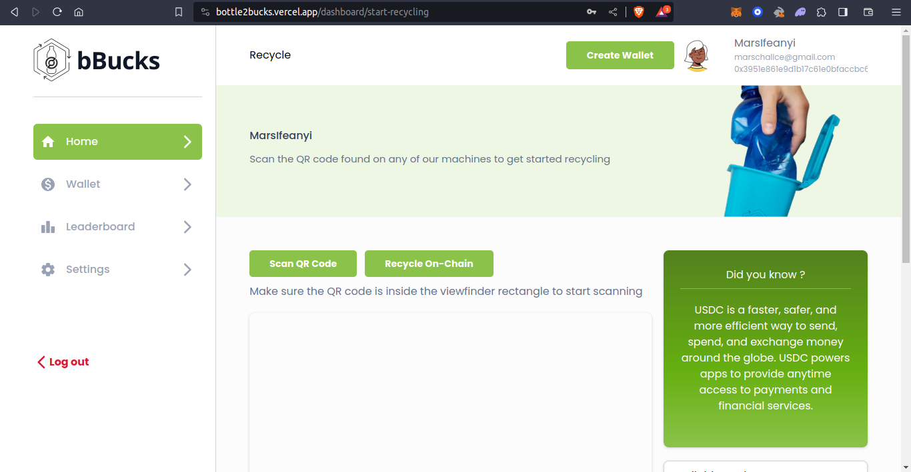
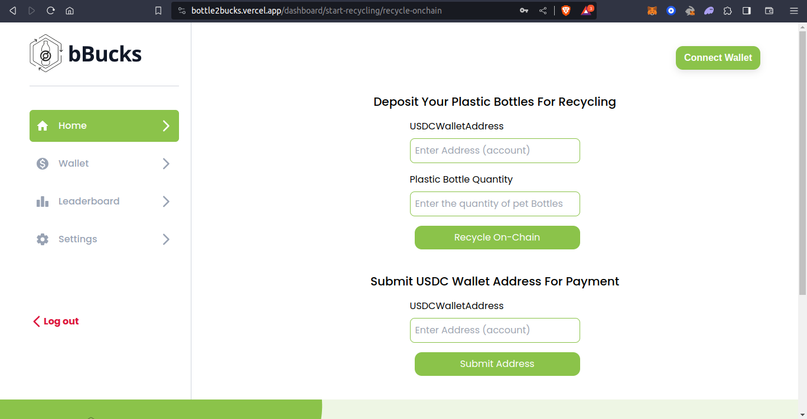
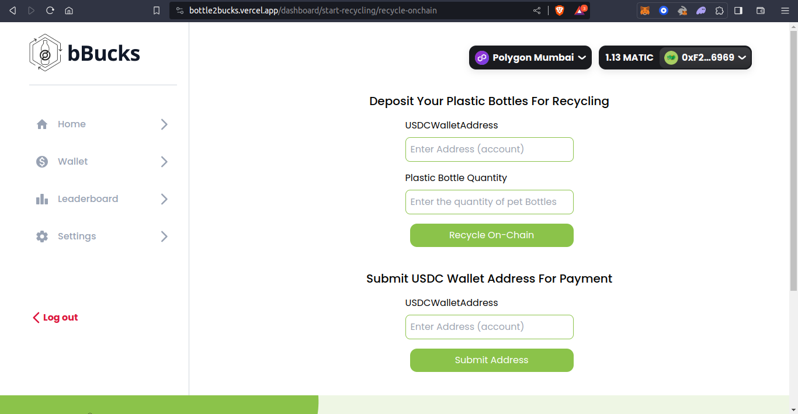
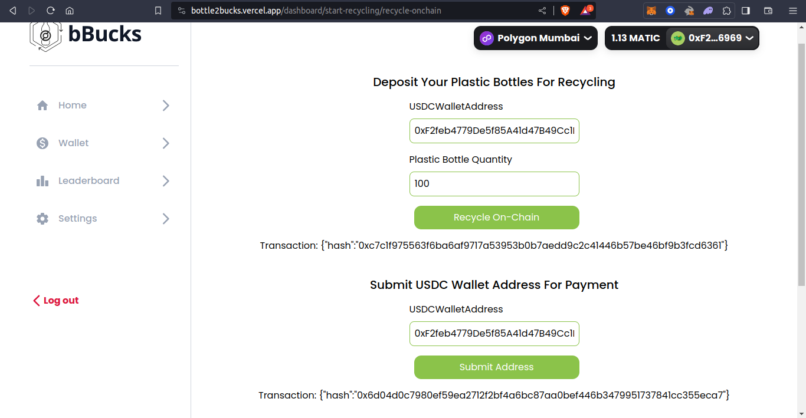

# Bottle To Bucks Decentralized Application

Bottle2Bucks is a Decentralized Application (dApp) that allows user to properly Dispose and Recycle used plastic (pet bottles). User will get paid the EDC token upon successful disposal and the BTB Token can be converted back to USDC by the user.

## Presentation Slide

https://drive.google.com/file/d/1GMC7JNVXlVJKtrcabVT11gy2Dhx0z43R/view?usp=sharing

## Design System (UI/UX)

https://www.figma.com/file/FzKTctpLROiNbZ2sitxOvk/bBucks?type=design&node-id=31-3983&mode=design&t=HBW5mlNmwMBu8YZo-0

## How it Works

1. User comes to our Dapp and sign up using email, password or Wallet.
2. Upon Successful Sign Up, user Creates a USDC Wallet (The Wallet is Created using the Circle API which was fully integrated in our dApp).
3. After Wallet Creation the User will be taken to the pool where user can then submit their pet bottles.
4. Users can deposit their used plastic bottles to our trash collection center (Liquidity Pool) using unique ID, and upon successful deposit at our pool users get the receipt token which serves as evidence.
5. After Successful deposit of Pet bottles Validation by the Pool Admin starts. After validation user will be notified on the status of his/her deposit.
6. User can then Submit their USDC address for payment.
7. If Validation is successful, Users will be able to redeem their receipt by depositing the receipt back to the pool and then USDC equivalent of the amount will be paid directly to their USDC Wallet.
8. For now our conversion rate is 0.1 USDC per Plastic Bottle.
9. The Proceed is paid directly into the User's USDC address upon successful confirmation.

## Contract Address

0x5c2c8c4e10807a9917814714be3490848305ec04

## PolygonScan Address:

https://mumbai.polygonscan.com/address/0x5c2c8c4e10807a9917814714be3490848305ec04

## Live dApp Url

https://bottle2bucks.vercel.app

## Demo Video:

## View of Our Bottle2Bucks dApp

- Home Page
  

- Login/SignUp
  

- Create USDC Wallet Using Circle API and Recycle-OnChain
  

- Recycle Pet Bottles
  

  

- Done Recycling and Submitting USDC Wallet address for payment
  

## Usage

- To use this app use the link of the deployed app, [bBucks](https://bottle2bucks.vercel.app) or clone the repository and cd into the directory such that you are on `frontEnd`
- To run this code, make sure you have [nodejs](https://nodejs.org) or [yarn](https://yarnpkg.com/) installed
- use the following command to run the code on your terminal

```bash
- install the needed dependency

#npm install

npm install


#yarn install

yarn install

- run the App locally

#npm run dev

npm run dev

# yarn dev

yarn dev
```

## Further Improvement

This is the first version of our Project and the following features will be coming implemented in the second version.

- IoT Count: An IoT device for real time counting of the plastics bottles and sending the counts onchain to be used by the priceFeeds for accurate conversion to local and cryptocurrencies.

- Price Feed: Oracles for external computations and price Feeds and value rate conversions will be implemented.

- Market Place: We are going to implement marketplace to that the users of our application can easily use the fund they get from recycling to buy something of their choice, if they don't want to convert it to their local currency.

- Leader board Badges: We already have leader boards thus we are going to add badges, levels challenges to it to encourage users to recycle more.
  Upon successful registration every user will have a default badge if they have verified their account.
  There is going to be an Algorithm that will auto push user to new level on the leader board and give them new badges based on the number of plastics bottles they have been able to recycle by using our application.

- Tokenization of Badges: To incentivize users for active recycling of plastics bottles, each badge will be tokenized and the token can be swapped with USDC or used to buy items in our market place.

- Sharing Feature: This feature will allow users to share their progress with the community, friends or in social media platforms, showing how they are actively contributing to sustainable environment for all by recycling.

- Educational Forum: The educational forum will be implemented so as to raise awareness about waste management, recycling best practice for environmental sustainability. Education videos and contents will be made available here and users will be rewarded for finishing any of the module.

- Environment Impact Assessment Card: An impact measurement feature will be added on the users dashboard, this will be give users the visuals of the positive impact they have made through their recycling efforts like example displaying waste diverted from certain areas or even pollution that was prevented through their recycling efforts. The Environment Impact Assessment Card will be sharable online or on social media.
